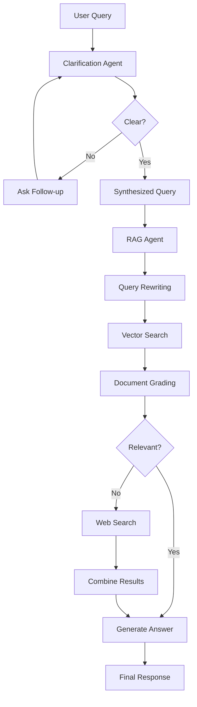

# 🏛️ Conversational Legal RAG Chatbot for Bangladesh


_A sophisticated AI-powered legal assistant specializing in Bangladeshi law, featuring conversational clarification and intelligent document retrieval._

📖 **Published Research**: [Springer - Advances in Intelligent Systems and Computing](https://link.springer.com/chapter/10.1007/978-3-032-11355-9_26)

---

## 📋 Table of Contents

- [🎯 Overview](#-overview)
- [✨ Features](#-features)
- [🏗️ Architecture](#️-architecture)
- [📁 Project Structure](#-project-structure)
- [🛠️ Installation](#️-installation)
- [🚀 Quick Start](#-quick-start)
- [📚 Legal Database](#-legal-database)
- [🤖 How It Works](#-how-it-works)
- [🔧 Configuration](#-configuration)
- [📊 Performance & Limitations](#-performance--limitations)
- [🤝 Contributing](#-contributing)
- [📄 License](#-license)
- [🙏 Acknowledgments](#-acknowledgments)

---

## 🎯 Overview

This project implements a cutting-edge **Conversational Legal RAG (Retrieval-Augmented Generation) Chatbot** specifically designed for Bangladeshi legal queries. Built using modern AI technologies, it combines:

- **Conversational AI** for natural query clarification
- **Vector Search** across 22+ comprehensive legal documents
- **Intelligent Web Search** fallback for comprehensive answers
- **Source Citations** for transparency and reliability

The chatbot serves as an educational tool and preliminary research assistant for understanding Bangladeshi laws, helping users navigate complex legal topics with confidence.

---

## ✨ Features

### 🤖 Dual-Agent Intelligence System

#### 1. **Clarification Agent** 📝

- **Natural Language Understanding**: Analyzes user queries for completeness and clarity
- **Interactive Dialogue**: Asks targeted follow-up questions when needed
- **Smart Synthesis**: Combines conversation context into precise legal queries
- **Loop Prevention**: Maximum 5 clarification rounds to avoid endless conversations

#### 2. **RAG Agent** 🧠

- **Semantic Search**: Vector-based retrieval from legal document database
- **Relevance Grading**: AI-powered document relevance assessment
- **Web Search Integration**: Tavily-powered web search for comprehensive coverage
- **Multi-Source Synthesis**: Combines local documents with web results

### 🎨 User Experience

- **Streamlit Web Interface**: Modern, responsive chat interface
- **Real-time Progress**: Visual feedback during processing
- **Source Citations**: Clear attribution to PDF files or web sources
- **Session Management**: Persistent conversation history
- **Error Handling**: Graceful degradation and user-friendly error messages

### 📊 Technical Capabilities

- **22+ Legal Documents**: Comprehensive coverage of Bangladeshi law
- **Batch Processing**: Efficient document embedding in configurable batches
- **Persistent Storage**: ChromaDB vector database with automatic persistence
- **API Integration**: OpenAI GPT-4o-mini and Tavily Search API
- **Graph Visualization**: Automatic generation of agent workflow diagrams

---

## 🏗️ Architecture



### Core Components

#### **Clarification Graph** (`LangGraph`)

- **State Management**: TypedDict-based state tracking
- **Node Functions**: Assess clarity, generate questions, handle user responses
- **Conditional Routing**: Dynamic flow based on conversation state

#### **RAG Graph** (`LangGraph`)

- **Multi-stage Processing**: Query optimization, retrieval, grading, generation
- **Fallback Mechanism**: Web search when local documents insufficient
- **Source Integration**: Unified context from multiple sources

#### **Vector Database** (`ChromaDB`)

- **Embedding Model**: OpenAI text-embedding-3-large
- **Similarity Search**: Cosine similarity with configurable thresholds
- **Batch Processing**: Efficient embedding of large document collections

---

## 📁 Project Structure

```
cse499-final-version/
│
├── app.py                          # Main Streamlit application
├── requirements.txt                # Python dependencies
├── .env                            # Environment variables (not in repo)
│
├── data/                           # Legal document storage
│   ├── constitution_of_BD.pdf
│   ├── The Code of Civil Procedure, 1908.pdf
│   ├── The Criminal Law Amendment Act, 1938.pdf
│   └── ... (22+ legal documents)
│
├── chroma_db/                      # Vector database (auto-generated)
│   ├── chroma.sqlite3
│   └── ... (vector embeddings)
│
├── __pycache__/                    # Python cache files
│
├── clarification_agent_graph.png   # Agent workflow visualization
├── rag_agent_graph.png            # RAG workflow visualization
│
└── README.md                       # This file
```

---

## 🛠️ Installation

### Prerequisites

- **Python 3.8+**
- **OpenAI API Key** (for embeddings and LLM)
- **Tavily API Key** (for web search)

### Step-by-Step Setup

1. **Clone the Repository**

   ```bash
   git clone https://github.com/your-username/legal-rag-bangladesh.git
   cd Advanced-RAG-System-with-Agentic-Workflow
   ```

2. **Create Virtual Environment**

   ```bash
   python -m venv venv
   source venv/bin/activate  # On Windows: venv\Scripts\activate
   ```

3. **Install Dependencies**

   ```bash
   pip install -r requirements.txt
   ```

4. **Environment Configuration**

   ```bash
   # Copy the example environment file
   cp .env.example .env

   # Edit .env and add your actual API keys
   # NEVER commit the .env file to version control
   ```

   **Required API Keys:**

   - **OpenAI API Key**: Get from [OpenAI Platform](https://platform.openai.com/api-keys)
   - **Tavily API Key**: Get from [Tavily](https://tavily.com/)

   **Security Note:** API keys are loaded from environment variables only. Never enter keys in the UI or commit them to version control.

5. **Add Legal Documents**
   ```bash
   # Place PDF files in the data/ directory
   # The app will automatically process them on first run
   ```

---

## 🚀 Quick Start

1. **Launch the Application**

   ```bash
   streamlit run app.py
   ```

   **Important:** Ensure your `.env` file contains valid API keys before launching.

2. **Access the Interface**

   - Open your browser to `http://localhost:8501`
   - The app will validate API keys from environment variables at startup
   - Wait for initialization (first run may take time for document processing)

3. **Start Chatting**
   - Ask questions about Bangladeshi law
   - The bot will clarify if needed, then provide detailed answers

### Example Queries

```
"What are the requirements for bail in non-bailable offenses under NDPS Act Bangladesh?"

"How to file a domestic violence case in Dhaka Family Court?"

"Section 138 cheque dishonour penalties under Negotiable Instruments Act"
```

---

## 📚 Legal Database

The chatbot includes **22+ comprehensive legal documents** covering:

### 🏛️ Constitutional Law

- **Bangladesh Constitution**: Fundamental rights and governance structure

### ⚖️ Criminal Law

- **Penal Code**: Core criminal offenses and punishments
- **Criminal Procedure Code**: Court procedures and trial processes
- **Criminal Law Amendments** (1938, 1944, 1948, 1958): Historical amendments

### 🏛️ Civil Law

- **Code of Civil Procedure, 1908**: Civil litigation procedures
- **Citizenship Act, 1951**: Citizenship rights and procedures

### 🌾 Land & Property Law

- **State Acquisition and Tenancy Act**: Land acquisition regulations
- **Land Reforms Ordinance**: Agricultural land reforms
- **Agricultural Land Laws**: Farming and land use regulations

### 💼 Commercial Law

- **Negotiable Instruments Act**: Cheque and financial instrument laws

### 👨‍👩‍👧‍👦 Social & Family Law

- **Domestic Violence Laws**: Protection against domestic abuse
- **Right to Information Act, 2009**: Access to government information

### 🏢 Administrative Law

- **Laws Revision and Declaration Acts** (1973, 2001): Legal framework updates

---

## 🤖 How It Works

### Phase 1: Query Clarification

1. **Initial Analysis**: LLM assesses query completeness
2. **Gap Identification**: Determines missing context (law type, location, specifics)
3. **Question Generation**: Creates targeted follow-up questions
4. **Synthesis**: Combines conversation into final clarified query

### Phase 2: Information Retrieval & Generation

1. **Query Optimization**: Refines query for vector database search
2. **Vector Search**: Semantic similarity search across legal documents
3. **Relevance Grading**: AI evaluation of retrieved documents
4. **Web Search Fallback**: Tavily search if local documents insufficient
5. **Answer Synthesis**: Combines sources into coherent, cited response

### Technical Flow

```python
User Query → Clarification Agent → Synthesized Query → RAG Agent →
Vector Search → Document Grading → Web Search (if needed) →
Answer Generation → Cited Response
```

---

## 🔧 Configuration

### Environment Variables

```env
# Required API Keys
OPENAI_API_KEY=sk-your-openai-key-here
TAVILY_API_KEY=tvly-your-tavily-key-here

```

### Application Constants

```python
# File: app.py
DATA_DIR = "./data"                    # Legal documents directory
PERSIST_DIR = "./chroma_db"           # Vector database location
COLLECTION_NAME = "Legal_data"        # ChromaDB collection name
EMBEDDING_BATCH_SIZE = 200           # Batch size for embedding
MAX_DOCS_PER_QUERY = 5               # Max documents per retrieval
MINIMUM_RETRIEVAL_SCORE = 0.1        # Similarity threshold
MAX_QUERY_CLARIFICATION_TURNS = 5    # Max clarification rounds
```

### Performance Tuning

- **Batch Size**: Adjust `EMBEDDING_BATCH_SIZE` based on available RAM
- **Retrieval Limit**: Modify `MAX_DOCS_PER_QUERY` for speed vs. comprehensiveness
- **Similarity Threshold**: Tune `MINIMUM_RETRIEVAL_SCORE` for precision vs. recall

---

## 📊 Performance & Limitations

### Strengths

✅ **High Accuracy**: Combines multiple sources for comprehensive answers  
✅ **Source Transparency**: Clear citations to PDF files and web sources  
✅ **Conversational**: Natural clarification process  
✅ **Comprehensive Coverage**: 22+ legal documents  
✅ **Fallback Mechanism**: Web search when local docs insufficient

### Current Limitations

⚠️ **Knowledge Cutoff**: Legal documents reflect laws as of 2023 and earlier  
⚠️ **No Personal Advice**: Educational tool, not legal counsel  
⚠️ **Language Scope**: Primarily English legal documents  
⚠️ **Web Dependency**: Requires Tavily API for comprehensive answers  
⚠️ **Resource Intensive**: Initial setup requires significant compute for embeddings

### Future Improvements

🔮 **Real-time Legal Updates**: Integration with official legal databases  
🔮 **Multi-language Support**: Bengali language processing  
🔮 **Case Law Integration**: Court precedent analysis  
🔮 **Legal Expert Validation**: Human-reviewed answer accuracy

---

## 🤝 Contributing

We welcome contributions to improve the Bangladesh Legal RAG Chatbot!

### Ways to Contribute

1. **Legal Document Updates**: Add newer legal documents or amendments
2. **Code Improvements**: Enhance agent logic, UI, or performance
3. **Bug Fixes**: Report and fix issues
4. **Feature Requests**: Suggest new capabilities
5. **Documentation**: Improve README, add tutorials, or create guides

### Development Setup

1. Fork the repository
2. Create a feature branch: `git checkout -b feature/your-feature`
3. Make your changes
4. Test thoroughly with various legal queries
5. Submit a pull request

### Guidelines

- **Legal Accuracy**: Ensure all legal information additions are verified
- **Code Quality**: Follow PEP 8, add docstrings, and include tests
- **Documentation**: Update README for any new features
- **API Keys**: Never commit API keys or sensitive information

---

## 📄 License

This project is licensed under the **MIT License** - see the [LICENSE](LICENSE) file for details.

**Important Legal Notice**: This chatbot is for educational and informational purposes only. It does not constitute legal advice. Always consult qualified legal professionals for actual legal matters.

---

## 🙏 Acknowledgments

### Technologies & Libraries

- **[Streamlit](https://streamlit.io/)**: Web application framework
- **[LangChain](https://langchain.com/)**: LLM application framework
- **[LangGraph](https://langchain-ai.github.io/langgraph/)**: Agent orchestration
- **[OpenAI](https://openai.com/)**: GPT models and embeddings
- **[ChromaDB](https://docs.trychroma.com/)**: Vector database
- **[Tavily](https://tavily.com/)**: Web search API
- **[PyMuPDF](https://pymupdf.readthedocs.io/)**: PDF text extraction

### Legal Resources

Special thanks to the Government of Bangladesh and legal document repositories for making comprehensive legal texts available for educational purposes.

### Academic Context

This project was developed as part of CSE499 (Computer Science Project) to demonstrate practical applications of AI in legal technology and information retrieval.

### Published Research

The methodology and findings from this project have been published in:

📖 **[Advances in Intelligent Systems and Computing - Springer](https://link.springer.com/chapter/10.1007/978-3-032-11355-9_26)**

_Citation_: Advanced RAG System with Agentic Workflow for Bangladeshi Legal Document Retrieval

If you use this work in your research, please consider citing our publication.

---

**Built with ❤️ for Bangladesh Legal Education**

_Empowering citizens with accessible legal knowledge through AI_

---

**📧 Contact**: abdullahalraiyan4@gmail.com

⭐ **Star this repository** if you find it helpful!
